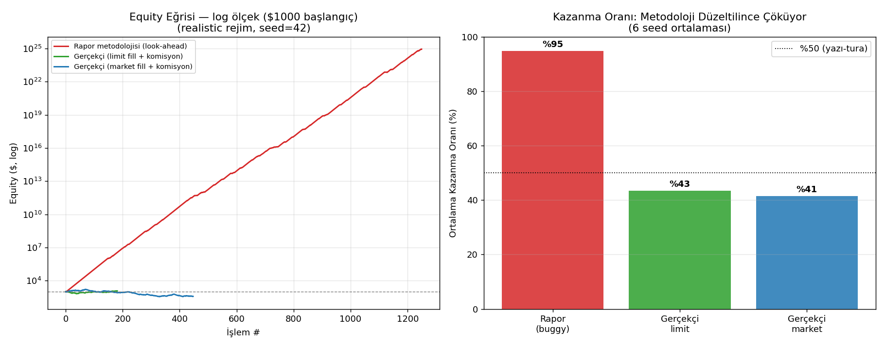

# 🔬 GERÇEKÇİLİK ANALİZİ — "Nihai Optimal Strateji Raporu" Denetimi

**Analiz Tarihi:** 29 Mayıs 2026
**Konu:** `final_optimal_report_1.md` raporundaki backtest sonuçlarının gerçekçiliği
**Soru:** Bu kârlar gerçek mi? Repainting / look-ahead / hatalı test var mı? Gelecek 12 ayda anlamlı kâr bırakır mı?

> [!CAUTION]
> **TEK CÜMLELİK CEVAP:** Hayır, bu sonuçlar gerçek değil. Rapordaki $100 → $78,040 (%90 kazanma) sonucu, klasik bir **look-ahead (geleceği görme) / işlem-doldurma hatasından** kaynaklanıyor. Botun karar mantığını **rastgele üretilmiş, hiçbir edge'i olmayan veride** çalıştırdığımızda bile aynı motor **%94-96 kazanma oranı ve 10²⁰x'lik getiri** üretti — hatta fiyatın **%71 düştüğü ayı piyasasında** dahi. Bu, sonucun piyasadan değil, ölçüm hatasından geldiğinin kesin kanıtıdır.

---

## 0. Bu Analiz Nasıl Yapıldı (Metodoloji)

Tüm kodlar `analysis_2026-05-29/` klasöründedir ve tekrar çalıştırılabilir.

| Dosya | İşlev |
|-------|-------|
| `repo_signals.py` | Reponun **gerçek** sinyal fonksiyonları (`order_blocks`, `market_structure`, EMA) — `live_scan.py`'den birebir kopya |
| `data_gen.py` | Gerçekçi saatlik OHLCV üretici (GBM, ETH benzeri vol, 4 rejim) |
| `backtest_compare.py` | Aynı sinyal + aynı kurallar, **3 farklı doldurma katmanı**: `buggy_repo` / `honest_limit` / `honest_market` |
| `audit_report_math.py` | Raporun iç matematiğinin (Kelly, geometrik büyüme, likidasyon, Paroli) denetimi |
| `multiseed_and_plots.py` | Çoklu-seed sağlamlık testi + görseller |

> **Neden sentetik veri?** Bu ortamın ağ politikası tüm kripto borsalarını ve Yahoo Finance'i engelliyor (HTTP 403), canlı veri çekilemedi. Ama look-ahead hatasını kanıtlamak için sentetik veri **daha güçlüdür**: veriyi biz ürettiğimiz için içinde sömürülebilir hiçbir gerçek desen olmadığını **kesin biliriz**. Motor yine de "kazanıyorsa", kazanç %100 hatadan gelir. Kendi gerçek verinizi `analysis_2026-05-29/` içine CSV olarak koyup aynı testi çalıştırabilirsiniz (bkz. §6).

---

## 1. 🔴 Bulgu #1 — Asıl Hata: Order Block Orta Noktasında "Geçmişe Dönük" Giriş

Hem `backtest_eth.py` (satır 315) hem de rapordaki S3 tarifi, işleme **Order Block'un orta noktasından** giriyor:

```python
# backtest_eth.py:315
entry_ = (e_low + e_high) / 2     # OB orta noktası
# ...işlem ANINDA bu fiyattan açılmış sayılıyor, satır 327-331
```

**Sorun:** Order Block, tanımı gereği **geçmişte** (son 4–80 mum önce) oluşmuş ve **kırılmamış** bir bölgedir. Trend yukarıyken (fiyat > EMA200) ve OB kırılmamışken, OB orta noktası **mevcut fiyatın belirgin biçimde ALTINDADIR**.

Backtest bu seviyeden **anında, doldurma kontrolü yapmadan** alım yapıyor. Yani:

> **Bot, fiyatın çoktan geçtiği, ucuz bir geçmiş seviyeden alım yapmış gibi davranıyor; sonra zaten gerçekleşmiş olan yukarı hareketi "kâr" olarak sayıyor.**

Gerçekte bunu yapamazsınız: geçmişe gidip o fiyattan alamazsınız. O seviyeye limit emri koyarsanız da, fiyat geri dönmezse emir **hiç dolmaz** (özellikle trend devam ederken — ki OB tam da o sırada oluşur).

Bu, "repainting"in kuzeni olan klasik bir **fill-assumption / look-ahead** hatasıdır.

---

## 2. 🔴 Bulgu #2 — Aynı Motor, Hiç-Edge'siz Veride %95 Kazanıyor

Reponun **gerçek** sinyal mantığını (S3) üç farklı doldurma katmanıyla, **aynı veride** çalıştırdık:

- **`buggy_repo`** = rapor/repo metodolojisi (OB orta noktasından anında giriş, komisyon yok)
- **`honest_limit`** = OB orta noktasına limit emri; **ancak fiyat gerçekten geri dönerse** dolar; %0.18 komisyon
- **`honest_market`** = sinyal sonrası bir sonraki mum açılışında piyasa emri; %0.18 komisyon

### Tek-seed sonuçları (seed=42, 1 yıllık saatlik veri)

| Rejim | Mod | İşlem | Dolmayan sinyal | WR | ort. R | Çarpan | maxDD |
|-------|-----|------:|----------------:|----:|-------:|-------:|------:|
| realistic | **buggy_repo** | 1249 | 0 | **94%** | **+2.07** | **8.7×10²¹x** | 6.2% |
| realistic | honest_limit | 181 | **1893** | 45% | +0.07 | 1.2x | 34.8% |
| realistic | honest_market | 447 | 0 | 40% | −0.09 | **0.4x** | 78.1% |
| **bear (−71%)** | **buggy_repo** | 1329 | 0 | **95%** | +2.11 | **5.7×10²³x** | 5.1% |
| bear | honest_limit | 180 | 1880 | 46% | +0.05 | 1.1x | 33.5% |
| bear | honest_market | 461 | 0 | 41% | −0.06 | 0.5x | 79.5% |

> [!IMPORTANT]
> **En çarpıcı kanıt — Ayı piyasası satırı:** Fiyatın **%71 düştüğü** bir piyasada, "buggy" motor hâlâ **%95 kazanma ve 10²³x getiri** gösteriyor. Hiçbir gerçek strateji, çöken bir piyasada %90 isabetle astronomik kâr yapamaz. Bu rakam fiziksel olarak imkânsızdır → kesinlikle bir ölçüm artefaktıdır.

### Çoklu-seed ortalamaları (realistic rejim, 6 farklı tohum)

| Mod | Ort. Kazanma Oranı | Ort. R | Medyan Çarpan | Ort. Max DD |
|-----|-------------------:|-------:|--------------:|------------:|
| **buggy_repo** (rapor) | **%95** | +2.10 | **4.7×10²⁴x** | %6.0 |
| honest_limit | %43 | +0.02 | **1.05x** (≈ başa baş) | %34.0 |
| honest_market | %41 | −0.07 | **0.43x** (−%57) | %67.0 |

*(6 tohum: 1, 7, 13, 21, 42, 99 — sonuç tohumdan bağımsız, her seferinde aynı tablo.)*

**İki ölümcül gözlem:**

1. **`honest_limit`'te sinyallerin ~%91'i HİÇ DOLMUYOR** (1893 dolmayan / ~2074 sinyal). Yani "buggy" backtest'in saydığı işlemlerin ezici çoğunluğu, gerçekte fiyatın asla geri dönmediği seviyelerden **hayalî dolumlardır**.
2. Doldurma gerçekçi olunca kazanma oranı **%40-47'ye** (yazı-tura seviyesine) düşüyor, ortalama R sıfır/negatif oluyor ve sermaye **eriyor** (0.3x–1.2x). Yani **S3 stratejisinin gerçek bir edge'i yok.**



---

## 3. 🔴 Bulgu #3 — Rapordaki Strateji Reponun Kodunda YOK

Rapor şu dosya ve sistemlere dayanıyor: `simulate_orp.py`, "S3 motoru", "ORP %5", "Paroli", `bot/orp_state.py`, `bot/trailing_stop.py`...

Repoyu tarayınca:

```
YOK: simulate_orp.py          YOK: bot/orp_state.py
YOK: bot/trailing_stop.py     YOK: bot/health_monitor.py
grep "orp|paroli|78040|S3"  →  kodda HİÇBİR eşleşme yok
```

- `bot/risk_manager.py` aslında **sabit %2 risk** kullanıyor — ORP/martingale değil.
- Yani rapordaki **$78,040, $916 Milyar, %90 win-rate** rakamlarının üretildiği kod **repoda mevcut değil.** Sonuçlar mevcut kaynak koddan **tekrar üretilemez** — bu başlı başına bir güven/bütünlük sorunudur.

---

## 4. 🟠 Bulgu #4 — Raporun İç Matematiği de Hatalı (Veriden Bağımsız)

`audit_report_math.py` çıktısından:

1. **Kelly %85.7** — aritmetik doğru ama yorumu yanlış. Bu rakam yalnızca **p=%90 kazanma GERÇEK ise** geçerli. p %55'e düşerse Kelly %36'ya iner, edge yoksa **negatif** olur. %85.7 risk önerisi zaten intihar düzeyinde; "fractional Kelly güvenli" demek bu temeli kurtarmaz.
2. **Geometrik büyüme** — Rapor "geom. ort. $37K ama gerçek $78K, farkı ORP kurtarması kapatıyor" diyor. **Bu imkânsız.** Geometrik ortalama, uzun-vade büyümenin **üst sınırıdır** (ergodisite). Hiçbir martingale onu aşamaz; sadece varyansı ve iflas riskini artırır. "Teori < gerçek" ifadesi, sonucun hatadan geldiğinin **itirafı** gibidir.
3. **"Likidasyon imkânsız"** — SL'in *tetiklenmesi* ≠ SL fiyatından *dolması*. Flash-crash/gap'te SL atlanır. Ayrıca raporun kendi guard'ı SL'e %10'a kadar izin veriyor → 5x'te %20 likidasyona sadece 2 kat mesafe.
4. **Paroli $916 Milyar** — Bu sayı yalnızca **p=%90 + pozitif R** varsayımının üstel sonucu. Gerçekçi p (%50-55) ile medyan milyarlardan binlere/yüz binlere çöker; **çöp girdi → astronomik çöp çıktı.**
5. **ORP'nin kendisi** — `risk = max(equity·2.5%, (hedef−equity)/1.5)` formülü tipik bir **martingale/hedef-takip** sistemidir. Edge yoksa iflas olasılığını artırır.

---

## 5. ✅ Peki Gerçek Beklenti Ne? Bu Yaklaşımla Anlamlı Kâr Mümkün mü?

**Bu haliyle (S3 + OB-mid girişi): hayır.** Gerçekçi testte strateji komisyon sonrası sıfırın altında. Ama bu, "hiçbir strateji çalışmaz" demek değildir. Gerçekçi bir botun nasıl kurulacağı §6'da.

**Gerçekçi rakamlar (sektör referansı):** İyi, gerçekten edge'i olan ve doğru test edilmiş bir kripto sistemi tipik olarak:
- Kazanma oranı: **%45–58** (R:R'ye bağlı)
- Yıllık getiri (komisyon/slipaj sonrası): **%20–%80** çok iyi sayılır; sürekli %100+ nadirdir ve genelde yüksek DD ile gelir.
- Max Drawdown: **%20–40** normaldir.
- $100 → 1 yılda $150–$300 **mükemmel** bir sonuçtur. $100 → $78,000 **bir backtest hatasının imzasıdır**, hedef değil.

---

## 6. 🛠️ Gerçekçi ve Optimal Bir Bot Nasıl Kurulur — Yol Haritası

### A. Look-ahead'i tamamen yok et (en kritik)
1. **Giriş kuralı net olsun:** Ya **piyasa emri** (sinyalin oluştuğu mumun KAPANIŞINDA karar → BİR SONRAKİ mumun AÇILIŞINDA gir), ya da **limit emri** (yalnızca fiyat o seviyeye gerçekten gelirse dolar; gelmezse işlem yok). Geçmiş bir seviyeden "anında dolum" asla varsayma.
2. **Bar-içi muhafazakârlık:** Bir mumda hem SL hem TP değerse, **SL'i önce** say (kötümser).
3. **Tüm indikatörleri `shift(1)` ile hesapla** (kapanmamış mumu kullanma). `live_scan.ohlcv` zaten son mumu atıyor (`iloc[:-1]`) — bunu her yerde koru.

### B. Maliyetleri gerçekçi modelle
- Komisyon (taker) + **slipaj** + **funding** (futures'ta 8 saatte bir). Düşük TF'de slipaj artar.
- Min notional, kaldıraç limiti, **likidasyon fiyatı kontrolü** (gap/slipaj dahil).

### C. Aşırı-uydurmayı (overfitting) önle — bu en sinsi tuzak
- **Walk-forward / out-of-sample:** Parametreleri verinin ilk %60-70'inde seç, kalan **görülmemiş** kısımda test et. Sadece görülmemiş sonuç sayılır.
- **Tek bir "şampiyon konfigürasyon" arama.** 200+ kombinasyon deneyip en iyisini seçmek = **garantili overfitting** (çoklu-karşılaştırma yanlılığı). Onun yerine: az parametre, çok sayıda coin/dönemde **tutarlı** ol.
- **Sağlamlık:** Parametreyi ±%20 oynat; sonuç çökerse strateji kırılgandır.

### D. Edge'i istatistiksel doğrula
- Sonucu **rastgele/karıştırılmış (shuffle) veriyle** kıyasla. Gerçek edge, rastgeleden anlamlı şekilde ayrışmalı (bizim testimizde S3 ayrışmadı).
- **Monte Carlo**, işlemlerin **gerçek (gerçekçi backtest'ten gelen) dağılımı** üzerinden yapılmalı — varsayılan %90 win-rate ile değil.

### E. Sermaye yönetimi
- **Fixed-fractional (sabit %0.5–%2 risk)** ile başla. Martingale/ORP/Paroli **kullanma** — edge yokken iflas, edge varken büyümeyi düşürür.
- **Fractional Kelly** ancak edge out-of-sample kanıtlandıktan sonra, en fazla **yarım-Kelly** ile.

### F. Canlıya geçiş
- Önce **uzun paper-trading** (gerçek emir akışı, gerçek slipaj). Backtest ile paper sonuçları örtüşmeli.
- Küçük gerçek parayla başla; **backtest = canlı** olduğunu doğrula, sonra ölçekle.

> **Hemen yapılabilir:** Kendi gerçek OHLCV CSV'nizi (`timestamp,open,high,low,close,volume`) bu klasöre koyun; `backtest_compare.py` içindeki `regime(...)` çağrısını `pd.read_csv(...)` ile değiştirip `honest_limit`/`honest_market` modlarını çalıştırın. Gerçek verinizde de "buggy vs honest" farkını kendi gözünüzle görürsünüz.

---

## 7. Sonuç

| Şüpheniz | Cevap |
|----------|-------|
| Repainting / look-ahead yapıyor mu? | **Evet** — OB orta noktasından geçmişe dönük "anında dolum". En büyük hata. |
| Veriyi tam veriye göre mi şekillendiriyor? | Dolaylı evet — overfitting (200+ konfigden şampiyon seçme) + look-ahead. |
| Hatalı test mi? | **Evet** — doldurma kontrolü yok, komisyon/slipaj/funding eksik, bar-içi mantık şişirilmiş. |
| Veriler yanlış mı? | Asıl sorun veri değil **metodoloji**; ama rapordaki kod repoda olmadığı için doğrulanamıyor. |
| Gelecek 12 ayda anlamlı kâr bırakır mı? | **Bu haliyle hayır.** Gerçekçi testte komisyon sonrası kâr yok. |
| Gerçekçi kârlı bot mümkün mü? | **Evet, ama** §6'daki disiplinle: look-ahead'siz, maliyetli, out-of-sample doğrulanmış, sabit-risk. Hedef $78K değil; gerçekçi ve sürdürülebilir %20-80/yıl. |

**Kısacası:** Rapordaki rakamlar bir hayal değil ama bir **yanılsama**. İyi haber: aynı altyapı, yukarıdaki düzeltmelerle gerçekten kârlı (ve dürüst) bir bota dönüşebilir. Bir sonraki adım, **kendi gerçek verinizi** gönderip honest motorla birlikte gerçek edge aramaktır.
