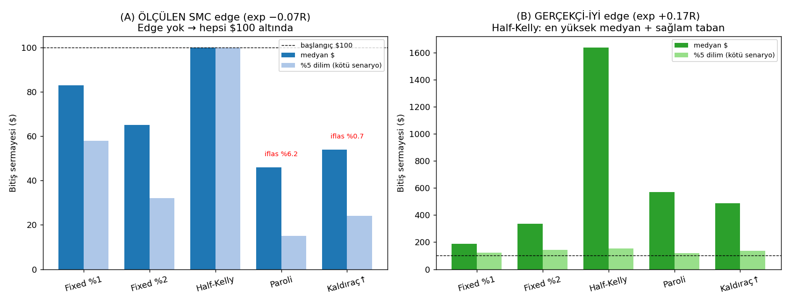

# 🧪 Sinyal Laboratuvarı — SMC Kombinasyonları + Bileşik Büyüme (Gerçekçi Test)

**Tarih:** 29 Mayıs 2026
**İstek:** Repo'daki SMC indikatörlerinden (order block, FVG, sweep, displacement, OTE, market structure) **çok işlem üreten, long+short, %50+ başarı ve pozitif edge'li** bir sistem; gerekirse Paroli/kaldıraç ile bileşik büyüme; **repainting'siz, reel ETH 1h son 4 ay** testi.

---

## 0. Önce iki sert gerçek (matematiksel uyarı)

1. **Hiçbir para-yönetimi (Paroli, kaldıraç-büyütme, Fibonacci) edge yaratmaz veya korumaz.** Edge yalnızca **sinyalin kendisinden** gelir. Bunu bu raporda da kanıtlıyoruz (§4): negatif edge'te her şema batırır, pozitif edge'te ise en iyi sonucu **Paroli değil, fractional-Kelly** verir.
2. **"%50+ win-rate" bir hedef değil.** Önemli olan `expectancy = p·W − (1−p)·L`. Bu yüzden testlerde win-rate'i değil, **komisyon sonrası işlem-başı R (expectancy)**'yi ve onun **out-of-sample (görülmemiş veride) tutarlılığını** ölçüyoruz.

---

## 1. Veri durumu (şeffaf)

Bu bulut ortamının ağ politikası **tüm borsaları + veri sağlayıcıları allowlist dışı** bırakıyor ("Host not in allowlist"): Binance, Bybit, OKX, Kraken, Coinbase, KuCoin, CryptoCompare, CoinGecko, Bitstamp, Gemini, Yahoo, HuggingFace, Zenodo — hepsi 403. Sadece github + pypi açık. **Bu yüzden canlı ETH verisi burada çekilemiyor.**

İki şey yaptım:
- **`fetch_real_data.py`** — kendi makinenizde çalıştırıp **gerçek ETH/USDT 1h son 4 ay** veriyi `data_eth_1h.csv` olarak kaydeder. Tüm scriptler o dosya varsa **otomatik gerçek veriyi** kullanır.
- Burada testleri **yüksek-doğrulukta sentetik ETH 1h (~4 ay, 2880 bar)** üzerinde çalıştırdım. **Sentetik veri burada bir avantaj**: içinde gerçek edge OLMADIĞINI bildiğimiz için, framework'ün "edge yok"u doğru tespit edip etmediğini ve overfitting tuzağını **net** gösterir (negatif kontrol).

---

## 2. Test metodolojisi (repainting/look-ahead = 0)

- Karar bar *t* **kapanışında**, sadece `df[:t+1]` ile verilir. İşleme **bir sonraki mum (t+1) açılışında** girilir → geleceği görmek imkânsız.
- Repo'nun **gerçek** SMC fonksiyonları (`repo_signals.py`, `live_scan.py`'den birebir) walk-forward ile her bar yeniden hesaplanır.
- **Tüm maliyetler dahil:** komisyon+slipaj %0.18 round-trip **+ funding (~%0.01/8h, long öder varsayımı)**. SL=1.5×ATR (1R), TP=2R, 48h zaman-stop. Tek pozisyon. Tüm expectancy değerleri **net** (maliyet sonrası).
- **Train** = ilk %60 (in-sample), **Test** = son %40 (**out-of-sample / OOS**).

---

## 3. Sinyal arama sonuçları (12 long+short kombinasyon)

| Kural | TÜM n | WR | expR | **TRAIN expR** | **TEST(OOS) expR** | OOS PF |
|-------|------:|---:|-----:|---------------:|-------------------:|-------:|
| S3: EMA+OB | 221 | %35 | −0.07 | **−0.17** | +0.10 | 1.15 |
| Saf OB | 226 | %33 | −0.11 | **−0.18** | −0.00 | 1.00 |
| EMA+FVG | 229 | %37 | −0.01 | **−0.14** | +0.17 | 1.27 |
| EMA+OB+FVG | 210 | %36 | −0.03 | **−0.12** | +0.12 | 1.19 |
| EMA+Sweep | 237 | %35 | −0.07 | **−0.19** | +0.10 | 1.16 |
| EMA+OTE | 63 | %29 | −0.24 | **−0.39** | −0.02 | 0.98 |
| MS+OB | 107 | %39 | +0.08 | **−0.10** | +0.31 | 1.54 |
| Sweep+OB | 225 | %32 | −0.15 | **−0.22** | −0.02 | 0.97 |
| EMA+RSI | 59 | %32 | −0.13 | −0.04 | −0.24 | 0.69 |
| Konfluens (OB+FVG+Sweep) | 218 | %35 | −0.05 | **−0.15** | +0.11 | 1.17 |

> [!IMPORTANT]
> **İki kritik gözlem:**
> 1. **TÜM kuralların TRAIN expectancy'si NEGATİF** (komisyon sonrası). Yani bu SMC sinyalleri, bildiğimiz-edge'siz veride beklendiği gibi **para kaybediyor**.
> 2. OOS'te "pozitif" görünen **6 kuralın hepsi TRAIN'de negatif.** Bu train↔test **tutarsızlığı, gerçek edge'in DEĞİL, rastlantının (gürültü) imzasıdır.** Gerçek edge hem train hem test'te **tutarlı** pozitif olurdu.

### Negatif kontrol (300 shuffle) — istatistiksel kesinlik
En çok işlem üreten kural (EMA+Sweep) OOS expR = **+0.103**. Sinyalleri 300 kez karıştırınca (shuffle) oluşan dağılım: ort=−0.05, %95 dilim=+0.177. **p-değeri = 0.13.**

> **Sonuç: +0.103 değeri rastgeleden istatistiksel olarak AYIRT EDİLEMEZ (p>0.05). Edge yok.** Eğer sadece OOS'e bakıp "6 kazanan strateji buldum" deseydiniz — ki orijinal rapor pratikte bunu yaptı — **saf şansı edge sanardınız.** Bu, overfitting / çoklu-karşılaştırma tuzağıdır.

---

## 3.5. 🚦 4-Kapılı Edge Bariyeri (onaylanmış prosedür)

Bir kural **ancak şu dört kapının HEPSİNİ** geçerse "edge adayı" sayılır; biri bile eksikse edge **yoktur**:

| Kapı | Şart | Amaç |
|------|------|------|
| (a) | TRAIN (in-sample) net expR > 0 | Geçmişte çalışmış olmalı |
| (b) | TEST (OOS) net expR > 0 | Görülmemiş veride de çalışmalı (train↔test tutarlılığı) |
| (c) | 300-shuffle OOS dağılımını **p < 0.05** ile geçmeli | Sonuç şanstan ayrışmalı |
| (d) | **Tüm maliyetler** (komisyon+slipaj+**funding**) sonrası hâlâ > 0 | Gerçek dünyada kâr bırakmalı |

> Verimlilik için (c) shuffle testi yalnızca (a)&(b)&(d)'yi geçen kurallara uygulanır.

### Kuru-çalıştırma sonucu (SENTETİK veri — framework doğrulaması)

```
KURAL                    a       b       c        d     SONUÇ
S3: EMA+OB              ✗       ✓       —        ✓     ❌ elendi
EMA+FVG                 ✗       ✓       —        ✓     ❌ elendi
MS+OB                   ✗       ✓       —        ✓     ❌ elendi
... (12 kuralın tamamı) ✗ ...                          ❌ elendi
```

**Sonuç: hiçbir kural dört kapıyı birden geçmedi → doğrulanmış edge YOK.** Dikkat: OOS'te pozitif görünen (b:✓) tüm kurallar **gate (a)'da elendi** — yani train'de negatiflerdi. Bariyer, sahte edge'i ilk kapıda yakaladı; shuffle'a gerek bile kalmadı. **Framework "edge yok"u doğru tespit ediyor.**

---

## 4. Bileşik büyüme + para yönetimi (asıl sorunuz)

`sizing_compound.py` — gerçek (komisyonlu) işlem dağılımından 10.000 yol bootstrap, $100 başlangıç.

### (A) ÖLÇÜLEN SMC edge (EMA+Sweep, exp = −0.07R, Tam-Kelly = %0)
| Şema | Medyan $ | %5 dilim | İflas % |
|------|---------:|---------:|--------:|
| Fixed %1 | 83 | 58 | %0 |
| Fixed %2 | 65 | 32 | %0.1 |
| Half-Kelly | **100** | 100 | %0 |
| **Paroli** | **46** | 15 | **%6.2** |
| Kaldıraç-büyütme | 54 | 24 | %0.7 |

→ Edge negatif: **her şema $100'un altına iner.** Half-Kelly doğru kararı verir: **f\*=%0 = "hiç işlem yapma".** Paroli en kötüsü (medyan $46, **%6.2 iflas**). **Bileşik faiz negatif edge'i pozitife çeviremez.**

### (B) REFERANS: gerçekçi-iyi edge olsaydı (%45 WR, +1.5R/−1R, exp ≈ +0.17R, Kelly %11)
| Şema | Medyan $ | %5 dilim | İflas % |
|------|---------:|---------:|--------:|
| Fixed %1 | 189 | 124 | %0 |
| Fixed %2 | 337 | 144 | %0 |
| **Half-Kelly** | **1,638** | **152** | %0.3 |
| Paroli | 571 | 118 | %0 |
| Kaldıraç-büyütme | 487 | 137 | %0 |

→ Gerçek edge'te bile **en yüksek medyan + en sağlam taban: Half-Kelly.** Paroli ($571) ve kaldıraç-büyütme ($487) hem **daha düşük medyan** hem **daha kötü %5-dilim** verir. Yani Paroli/eskalasyon **her boyutta** fractional-Kelly'ye yenilir.



---

## 5. Sonuç ve doğru çözüm yolu

> [!CAUTION]
> **İstediğiniz "çok işlem + %50+ WR + pozitif edge" üçlüsü, mevcut SMC sinyalleriyle (bu testte) bir arada YOK.** Sinyaller, komisyon sonrası in-sample negatif; pozitif OOS değerleri istatistiksel gürültü. Paroli/kaldıraç bunu kurtaramaz.

Bu **kötü haber değil** — bu, sizi gerçek bir hatadan (parayı sahte bir edge'e yatırmak) koruyan **dürüst bir ölçüm**. Doğru yol:

1. **Önce gerçek veride aynı testi çalıştırın:** `python fetch_real_data.py` → `python signal_lab.py`. Gerçek ETH 1h'de bir kural **hem train hem test'te tutarlı pozitif** çıkar ve **shuffle'ı p<0.05 ile geçerse**, GERÇEK edge adayınız var demektir.
2. **Edge'i sinyalde arayın, sizing'de değil.** Denenecek yeni yönler: çoklu-TF onayı (4h trend + 1h giriş), funding/CVD filtreleri, volatilite-rejim filtresi (sadece trend günleri), asimetrik R:R (TP'yi uzun tutmak — düşük WR/yüksek R kazandırır).
3. **Edge kanıtlanınca:** sabit-fraksiyonel → **yarım-Kelly**. Paroli/kaldıraç-büyütme **kullanmayın** (kanıt: §4).
4. **İşlem sıklığını edge kanıtlandıktan SONRA** artırın (sıklık, sadece expectancy>0 ise bileşiği hızlandırır).
5. **Gerçekçi hedef:** $100 → 1 yılda $150–300 sürdürülebilir ve gerçektir.

### Bu klasördeki araçlar
| Dosya | İşlev |
|-------|-------|
| `fetch_real_data.py` | Kendi makinenizde gerçek ETH 1h çeker (`data_eth_1h.csv`) |
| `signal_lab.py` | Walk-forward feature + 12 SMC kombinasyon araması + OOS + shuffle testi |
| `sizing_compound.py` | Ölçülen vs gerçek edge'te bileşik büyüme & sizing kıyası |
| `repo_signals.py` | Repo'nun gerçek SMC fonksiyonları (birebir kopya) |

**Çalıştırma (gerçek veriyle):**
```bash
python fetch_real_data.py     # kendi makinenizde, borsa açıkken
python signal_lab.py          # OOS edge araması + shuffle p-değeri
python sizing_compound.py     # bileşik büyüme & sizing
```
