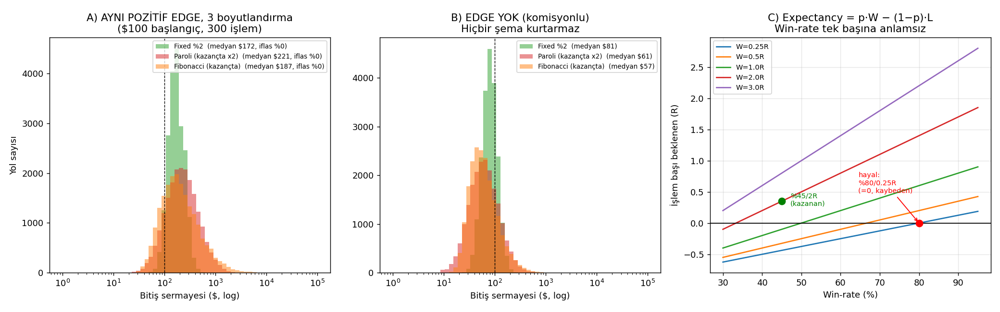

# 🧭 Strateji Mantığınızın Denetimi ve Gerçek Çözüm Yolu

**Soru:** "%2/işlem bileşik + yüksek win-rate + kazançta kaldıraç/Fibonacci büyütme + indikatör azaltıp işlem sıklığını artırma" mantığı doğru mu?

**Kısa cevap:** Mantığın **3 parçası doğru**, **3 parçası matematiksel olarak hatalı**. Hatalı parçalar tam da bir önceki raporu üreten yanılgının kaynağı. Aşağıdaki her madde `strateji_mantik_analizi.py` ile simüle edilerek kanıtlandı (çıktı: `strateji_mantik_sonuc.txt`, görsel: `fig_mantik_analizi.png`).

---

## ✅ DOĞRU olan sezgileriniz

1. **Bileşik faiz güçlüdür.** $100 × 1.02³⁶⁵ = $137,741 — aritmetik doğru.
2. **İnput (indikatör) azaltmak İYİDİR.** Az parametre = az overfitting = daha sağlam. Bu sezginiz çok değerli; çoğu kişi tersini yapar.
3. **İşlem sıklığı, GERÇEK pozitif edge varsa, bileşik büyümeyi hızlandırır.** (Şart: expectancy > 0. Yoksa sıklık sadece komisyonu ve kaçınılmaz kaybı öne çeker.)

---

## ❌ HATALI olan 3 varsayım

### Hata 1 — "%2/işlem" hedefi gerçekçi değil; o rakam look-ahead'in ta kendisi

"+%2/işlem net" demek, %2 risk alıyorsanız **işlem başına +1R expectancy** demek — yani **pratikte hiç kaybetmemek**. Gereken win-rate:

| Ödül (W) | +%2/işlem için gereken win-rate |
|----------|--------------------------------|
| W=1R | **%100** (imkânsız) |
| W=2R | %67 |
| W=3R | %50 |

Profesyonel sistemler **yıllık** %20–80 hedefler. "+%2/**işlem**" sadece geçmişi gören (look-ahead) backtest'te "görünür". Bir önceki analizde bunu kanıtladık.

> Ek gerçek: %80 win-rate'te bile 365 işlemde bir yerde **~3-4 ardışık kayıp** istatistiksel olarak BEKLENİR (rastgelelik). Sistem bunu kaldırabilmeli.

### Hata 2 — "Kazançtan sonra kaldıraç/Fibonacci büyütmek kârda tutar" → YANLIŞ

Bu bir **anti-martingale**. Matematiksel teorem: **hiçbir pozisyon-boyutlandırma şeması işlem başı expectancy'yi değiştirmez.** Sadece dağılımı (varyans, drawdown, iflas riski) değiştirir. Simülasyon (aynı edge, 20.000 yol, 300 işlem):

| Senaryo | Şema | Medyan $ | İflas % | Ort. maxDD |
|---------|------|---------:|--------:|-----------:|
| **Edge YOK** (komisyonlu, E≈−0.03R) | Fixed %2 | **$81** | %0 | %38 |
| | Paroli (kazançta ×2) | **$61** | %0.3 | %62 |
| | Fibonacci (kazançta) | **$57** | %0 | %62 |
| **Sizin hayaliniz** (%80 WR, küçük R, E=0) | Fixed %2 | **$98** | %0 | %19 |
| | Paroli | $92 | %0 | %41 |
| | Fibonacci | **$68** | %0.4 | %65 |

> [!WARNING]
> **En kritik satır:** %80 win-rate olsa BİLE, küçük R (E=0) + Fibonacci eskalasyon → medyan $100'den **$68'e düşüyor**, drawdown %65, hatta iflas çıkıyor. "Kazançta büyüt", biriken kârı **tam tepede gelen tek kayba** teslim eder.

Pozitif edge varsa eskalasyon getiriyi artırabilir ama **bedava değil** — drawdown'u %22'den %43'e çıkarır. Aynı etkiyi Fixed risk'i artırarak da alırsınız; sihir yoktur. Doğru araç: **sabit-fraksiyonel risk (Kelly'nin yarısı kadar)**.

### Hata 3 — "Çok indikatör = yüksek win-rate" ve "win-rate hedeftir" → YANLIŞ

**Win-rate bir hedef değil, bir ayar düğmesidir.** TP'yi yakına / SL'i uzağa koyarak win-rate'i istediğiniz kadar yükseltebilirsiniz — ama bu beceri değildir, expectancy'yi değiştirmez:

`expectancy = p·W − (1−p)·L`

| Win-rate | W=0.25R | W=1R | W=2R |
|---------:|--------:|-----:|-----:|
| %45 | −0.44 | +0.35 | **+0.35** ✅ |
| %80 | **0.00** ❌ | +0.60 | +1.40 |

- **%80 win-rate + W=0.25R → E=0** (komisyonla negatif). **Kaybeden.**
- **%45 win-rate + W=2R → E=+0.35R.** **Kazanan.**

Daha fazla indikatör "gerçek" win-rate'i artırmaz; **overfitting ve look-ahead yüzeyini** artırır (önceki raporda S3'ün %90'ı tam da böyle sahteydi). İndikatörü "veri" olarak görme jargonunuz mantıklı — ama **her ek veri serbestlik derecesi ekler ve aşırı-uydurmayı kolaylaştırır.**

---

## 🎯 GERÇEK ve OPTİMAL Çözüm Yolu

Hedefi **win-rate ve %2/işlemden**, şuraya kaydırın:

> **Out-of-sample (görülmemiş veride) pozitif EXPECTANCY ve yüksek Sharpe.**

### Adım adım

1. **Metrik değiştir:** Win-rate'i bırak. İzlenecek: işlem başı ortalama R (expectancy), Profit Factor, Sharpe/Sortino, Max DD — hepsi **OOS** veride.
2. **Az ama dik (ortogonal) input:** 2-4 birbirinden bağımsız sinyal yeter (örn: 1 trend filtresi + 1 zamanlama + 1 oynaklık/rejim filtresi). Birbirini tekrar eden 16 indikatör = 1 indikatör + gürültü.
3. **Look-ahead'i öldür:** Giriş ya market (sinyal mumu KAPANINCA, sonraki mum AÇILIŞINDA) ya da gerçekten dolan limit. İndikatörler `shift(1)`. (Detay: `GERCEKCILIK_ANALIZI.md` §6.)
4. **Maliyet modeli:** komisyon + slipaj + funding. Düşük TF'de slipaj büyük.
5. **Walk-forward doğrulama:** Parametreyi verinin ilk %60-70'inde seç, kalan görülmemiş kısımda ölç. Tek "şampiyon" arama → çoklu-karşılaştırma overfitting'i.
6. **Sağlamlık testi:** Parametreyi ±%20 oynat; sonuç çökmesin. Birden çok coin/dönemde tutarlı olsun. Shuffle/rastgele veriye karşı anlamlı ayrışsın.
7. **Sabit-fraksiyonel sermaye:** %0.5–%2 sabit risk; edge OOS kanıtlanınca **yarım-Kelly**'ye kadar. Martingale/ORP/Paroli/Fibonacci **yok**.
8. **Sıklık, edge'i kanıtlandıktan SONRA artırılır:** Önce 1 işlemde pozitif beklenti; sonra daha çok işlem = daha hızlı bileşik. Sırası tersi olursa felaket.

### Gerçekçi başarı tanımı
$100 → 1 yılda **$150–$300** sürdürülebilir, dürüst ve tekrarlanabilir bir sonuçtur. $137K hedefi değil, bir backtest hatasının imzasıdır.

---

## Özet tablo

| İddianız | Hüküm | Neden |
|----------|-------|-------|
| %2/işlem, 365'te $137K | ❌ Gerçekçi değil | +1R/işlem = hiç kaybetmemek; look-ahead artefaktı |
| Kazançta kaldıraç/Fibonacci büyüt | ❌ Edge yaratmaz | Expectancy sabit; sadece DD/iflas artar, kârı tepede kaybettirir |
| Çok indikatör = yüksek win-rate | ❌ Tersine zararlı | Overfitting + look-ahead; "gerçek" WR artmaz |
| Win-rate'i %80'de tut | ❌ Yanlış hedef | WR bir düğme; önemli olan p·W−(1−p)·L |
| İnput azalt | ✅ Doğru | Az parametre = sağlam, az overfitting |
| İşlem sıklığını artır | ⚠️ Şartlı doğru | Sadece OOS expectancy>0 ise faydalı |
| Bileşik faiz güçlü | ✅ Doğru | Ama girdisi gerçek edge olmalı |
